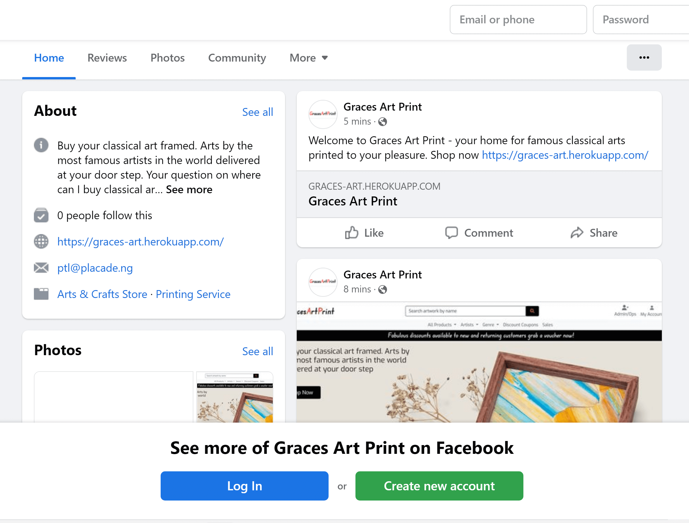

# **GRACES ART PRINT WEBSITE**

The Graces Art Print is a web application that enables users to purchase an artwork and frame for printing. The purchased artwork and frame would be used to produce a framed artwork delivered to the user's supplied address.  

## Live Site

[Graces Art Print Live](https://graces-art.herokuapp.com)

## Repository

[View Repository Here](https://github.com/Polyanyanwu/graces-art-pp5)

## Table of Contents

- [**GRACES ART PRINT WEBSITE**](#graces-art-print-website)
  - [Live Site](#live-site)
  - [Repository](#repository)
  - [Table of Contents](#table-of-contents)
  - [**Objectives of the Site**](#objectives-of-the-site)
  - [**User Experience Design**](#user-experience-design)
    - [**Initial Design Features**](#initial-design-features)
      - [**User Interaction**](#user-interaction)
    - [**User Roles**](#user-roles)
      - [**A. Admin user**](#a-admin-user)
      - [**B. Operator**](#b-operator)
      - [**C. Public**](#c-public)
    - [**Agile Initiative**](#agile-initiative)
      - [**Epics**](#epics)
    - [**User Stories**](#user-stories)
    - [GitHub Projects](#github-projects)
    - [**Wireframes**](#wireframes)
    - [**Color Scheme**](#color-scheme)
    - [**Fonts**](#fonts)
  - [**Database Design**](#database-design)
  - [**Flowchart**](#flowchart)
  - [**Search Engine Optimization**](#search-engine-optimization)
    - [**Keywords Research**](#keywords-research)
  - [**E-commerce Business Model**](#e-commerce-business-model)
    - [**Web Marketing Strategies**](#web-marketing-strategies)
      - [**Search Engine Optimization (SEO)**](#search-engine-optimization-seo)
      - [**Content Marketing**](#content-marketing)
      - [**Social Media**](#social-media)
      - [**Email Marketing**](#email-marketing)
      - [**Paid Advertising and Influencer Marketing**](#paid-advertising-and-influencer-marketing)
    - [Facebook Page](#facebook-page)
  - [**Features Implemented**](#features-implemented)
    - [**Sign Up \& Login**](#sign-up--login)
    - [**The Landing Page**](#the-landing-page)
    - [Public User Functionalities](#public-user-functionalities)
      - [**List of Artworks**](#list-of-artworks)

## **Objectives of the Site**

The site has objective of providing easy to use application for selection of famous artwork images for printing. The user desires to select an artwork, chose a frame and size for the production, view the resultant cost of the artwork and get the produced work shipped to the desired location. The site owner wants to manage available frames, receive online payments for the user choices and ship the artwork once it has been produced. The application will provide historical and statistical reports to the validated user, the operator and the admin user.

## **User Experience Design**

### **Initial Design Features**

- The application will enable the user to select an artwork to print based on various criteria – genre, artist, style or generally by the name of the artwork.
- Different frame types will be displayed for the user to choose from.
- The print sizes will be listed to enable the user indicate the preferred print size.
- The quotation for the print is generated automatically after factoring in the frame and size of the picture.
- A shopping bag and wish list are maintained for the user. An item could be moved to the shopping bag from the wish list.
- A checkout process will enable the user add the delivery details, discounts applied where available and final cost to pay is determined. When payment is received, an email is sent to the user confirming payment and providing details of expected delivery date depending on shipping method selected.
- An order could be canceled before shipment and within a specified period. After the given period the order can no longer be cancelled. Defective prints could be returned and replaced within a given period at no extra cost to the customer.
- The item is marked as shipped by the site operator when shipped, and updated as delivered by the site operator when customer has received the item (name and date/time is entered to indicate who received the item).
- Authenticated customers can view messages and alerts sent to them regarding progress of their order and could choose to archive or delete such messages.
- Discount Vouchers are available to:

1. A given percentage to first time visitors who registers with the site and chose to complete a purchase.
2. Customers who purchase items above a stated sum of money.
The vouchers will be applied at checkout.

- The access to the application will be role based and user views only menu options that are available to the assigned role for the user.
- Product ratings will display besides the product listing. Clicking on the ratings will navigate the user to the testimonials for details of customer ratings on our services. Only customers that have purchased an item previously are permitted to write reviews.
- The Site Administrator will be able to add or delete an artwork; add, delete and update quantities of frames available for print job. A customer may not select a frame that is out of stock.

#### **User Interaction**

- A user will need to login to complete a purchase. Initially the artwork and shopping bag will be available. User could decide to put items into the shopping bag first but to complete the purchase, the user needs to create an account and provide delivery address.
- An email address and password would be sufficient to create an account, but the email has to be confirmed. A user remains signed in until user choses to sign out, in line with current UX design.
- When a user places an order successfully, it will appear on the order list, any cancellation will appear on the update messages dropdown.
- Confirmation of order, cancellations or request for return will fire an email to the user informing them accordingly. Admin could disallow a return of a delivered artwork giving the user valid reasons for the refusal.
- Login button will change to Logout when a user successfully logged in. The name of the logged in user will be displayed.

[>> Bact to TOC](#table-of-contents)

### **User Roles**

There shall be three roles for the application:

#### **A. Admin user**

1. Assign user role to signed-in users
2. Set system preferences
3. Update order status – change status to shipped after artwork has been shipped or delivered after customer has received artwork
4. Maintain artwork, add/delete artwork, add/delete genre, add/delete artist, add/delete art styles.
5. Maintain frame types and quantities available
6. Maintain discount vouchers and percentage discounts on them
7. Maintain reason for return of order
8. Maintain reason for cancellation of order.

#### **B. Operator**

1. Review request for return of artwork and take action.
2. Update order status – change status to shipped after artwork has been shipped or delivered after customer has received artwork
3. Enquiry on the details of orders for a given period

#### **C. Public**

1. Sign-in to the site
2. Make orders
3. Cancel orders
4. Enquiries on order history
5. Return defective prints
6. View/delete messages

Only the Admin will use the Admin portal, while Operator and Public will use the application main page. Accessible menu items will depend on the role assigned to the user by the administrator.

[>> Bact to TOC](#table-of-contents)

### **Agile Initiative**

The project will consist of one initiative which is to provide an intuitive user-friendly online store for the sale of artwork to the public.

#### **Epics**

The functionalities in the application shall be provided through two user epics:

1. The application shall provide a role-based access control enabling users to register with the site, maintain passwords, and possibly integrate with social media for authentication.
2. The application shall provide online selection of artwork, frame and dimension for the printing of the work and delivery to the user after payment.

### **User Stories**

The User Stories for the application was developed before commencement of the application and guided the process. The User Stories were entered as Issues on GitHub repository for the application and used to guide the management of the project. The User Stories were grouped into four:

- Customer Stories
- Operator Stories
- Authentication stories
- Site Owner/Admin stories
  
Detailed User Stories are [provided HERE](/docs/user_stories.md)

### GitHub Projects

Two projects were used in the GitHub to manage the project. There were two iteration timeboxes implemented with Milestones/Sprints of two weeks duration each. The links to the projects are given below:

[First Iteration: Graces Art](https://github.com/users/Polyanyanwu/projects/6)  
[Final Iteration: Graces Art](https://github.com/users/Polyanyanwu/projects/7)

MoSCow prioritization was used and the User Stories were categorized into "Must Have", "Could Have" and "Should Have". The categories were implemented as labels on GitHub.

Major bugs encountered in the course of the development were raised on GitHub as issues and closed when resolved.

[>> Bact to TOC](#table-of-contents)

### **Wireframes**

Wireframes were designed at the onset of the project and guided the development of the application. The full wireframes are [provided HERE](/docs/wireframe.md)

### **Color Scheme**

In order to enhance the user experience and have consistent look and feel throughout the website, I chose a color scheme through the [Colors.co](https://coolors.co/). The color palette used is shown below:

### **Fonts**

The font for the website is "Exo" and "Edu NSW ACT Foundation', cursive", which was chosen from [Google fonts](https://fonts.google.com/specimen/Exo?query=exo). This font looks great to me for a website where the user need not struggle to see details of the site. THe Edu cursive was used for the logo and banner while the Exo was used for the body.

## **Database Design**

The database used in this project is a relational database, Postgres provided by Heroku.

The initial design database Entity Diagram is given below:

## **Flowchart**

The initial flowchart for the user interaction with the website has been produced to guide the application development. As the site unfolds, it may differ slightly as requirements may change in the course of development.

## **Search Engine Optimization**

### **Keywords Research**

I initially did a brainstorming session and listed the following keywords I consider relevant to the application for the purpose of search engine optimization.

- Art gifts
- Printed arts
- Classical artwork
- Print classical artwork
- Buy printed artwork
- Buy classical printed artwork

I then went to Google and looked up the above keywords and got suggestions while typing. Also considered the  “People also ask” and “Related searches”  sections on the google results page and came up with the following keywords:

- Artwork for sale
- Print ready artwork
- Buy album artwork
- Buy printed artwork
- Where can I buy art prints for sale?
- Buy classical art
- Classical art prints
- Classical art prints framed
- Famous art prints
- Famous paintings
- Buy prints of famous artists
- Framed prints online Ireland

The next step was on [WordTracker](https://www.wordtracker.com/)  to have a feel of the relevance and authoritativeness of the data available on keyword volume and competition.

I searched “classical art”,  “art print” and “famous paintings” on [WordTracker](https://www.wordtracker.com/) and came up with the following considering the volume and competition:

- Classical art
- Classical artwork
- Framed prints
- Art print
- Framed photos
- Famous painting
- Famous artist

In view of the above, my keywords for the Graces Art Prints website is given below:

| Short-tail Keywords            | Long-tail Keywords                      |
|--------------------------------|-----------------------------------------|
| Classical art prints           | Framed photos of classical art          |
| Classical artwork              | Buy prints of famous artists            |
| Famous artists                 | Framed classical art prints             |
| Famous paintings               | where can I buy classical art in Dublin |
| Buy printed artwork            | Buy classical art printed               |

The above keywords would be included in the meta of the website and be considered in the relevant pages as they form the core of the product that is being marketed by the website.

## **E-commerce Business Model**

The business is an online shop where users browse and select classical artwork and a frame to print the artwork on. The shipping cost is a percentage of the total but has an upper limit. There are selected items on sale at each time available at the Sales page that has link visible at all pages. There are also discount codes which any visitor to the site can download and use at checkout. The footer contains links to information about us, frequently asked questions and other relevant information including a Mailchimp email subscription form. We intend to take online orders, produce the work and ship to customers.

### **Web Marketing Strategies**

I considered different approaches to web marketing and visited sites of similar online shops taking cognisance of the Code Institute course notes on WEb Marketing. Below is my marketing strategies.

#### **Search Engine Optimization (SEO)**

The e-commerce business is an online retail type and search engine optimization will enable users easily find it online. I researched on relevant keywords for the business and developed both short-tail and long-tail keywords that was included at the header of all the pages and in the relevant content. For example I included the keywords “classical art framed”, “famous artists” in the welcome message on the landing page.

#### **Content Marketing**

Providing enticing content to my prospects is very essential since my customers are lovers of art and beauty. I intent to record videos of previous work done by the company and some on the production process.  These videos would be made available through the Facebook and YouTube pages to reach a greater audience. Pages on the website could also have such information for visitors. The site runs sales most of the time. The items on sale are available via a click of a link on all pages. Discounts vouchers are available for all users to view and copy from the site.

#### **Social Media**

The business will use organic social media marketing as it is quite suitable for new businesses like this that is digital online shop. This will enable the business interact with prospects and put a human touch to the marketing effort. The site has a [Facebook page](href="https://www.facebook.com/Graces-Art-Print-110351491783521), which will be monitored for users comments and feedback and responded to accordingly. If short videos or images of latest work work are produced at any time, it will be posted on the Facebook page. Additionally, the business will use WhatsApp platform to chat with users that need special attention or clarifications. When the business picks up paid Facebook promotions will be added.

#### **Email Marketing**

The business will use email marketing and is collecting email addresses on the website using the Mailchimp plugin. Emails will be sent to subscribers as the need arises and when new offers are available. To avoid spam, the emails will not be too frequent.

#### **Paid Advertising and Influencer Marketing**

Paid advertising and influencer marketing is not part of the strategy at the beginning since they could be expensive to run. Moreover the target customers may not be influenced by paid adverts or someone else saying much about us and our products. What will speak more for the business is showcasing previous work on videos, images on social media and web pages where customers could be attracted watching such content.

Affiliate marketing is not feasible at the onset. However, I have included link to another online shop [(BGA)](https://www.bgastore.ie/) where our users can see other frame options. As the business unfolds, we can earn commission from such referral and also engage that organization to refer people to us for print jobs.

### Facebook Page

A Facebook business page was created for the e-commerce business available at [Facebook](href="https://www.facebook.com/Graces-Art-Print-110351491783521). The Facebook page features the logo, landing page, link to the website, location city of the business, brief description of the business where some of the keywords were used. The type of business was put as Arts & Crafts and an initial post introducing the business was made. Find below screenshots of the Facebook page.

## **Features Implemented**

The website enables visitors order the printing of artwork using desired frame. Although it is not required to sign-up with the website to complete a purchase, functionalities like "Return or Cancellation of Order" requires a login at the time of ordering. To login successfully a user need to sign-up with a valid email address. There are three roles for the application public, operator and administrator. We shall discuss the features under these three roles in addition to the sign up process.

### **Sign Up & Login**

When the website opens to a new user, My Account and bag icon is displayed on the right edge. Clicking the My Account will open the menu having "Register" and "Login" items.

Click on the Register menu item will display the "Create an Account" page where the user details and email are inputted. All the fields are required and the email will be verified before a user is able to login.

Once the form is completed, the user is informed that an email has been forwarded to the given address for verification. The email will usually be received within few minutes depending on the network situation.

Clicking on the link provided in the email verification will direct the user to a page to click to verify the email. Once the user clicks on the Confirm button, the user is routed to the Login page.

The user can login with either the username or email address provided during the register account. If the credentials inputted are correct, an acknowledgement of the successful login is given at the top right edge. My Account icon only will display if the user is public or My Account and Admin/Ops icon is additionally displayed if the user belong to the Administrator or Operator group.

If the username/email and password provided do not match, a message is displayed to the user and login is not permitted.

[>> Bact to TOC](#table-of-contents)

### **The Landing Page**

The landing page of the website presents the user with a welcome message and Shop Now button. The footer section shows four columns: Information (about us, FAQ, Contact US, and Reviews); the Legal colum has Terms & Conditions and Privacy Policy. The Social Media column has links to Facebook page of the website, the Github page of the developer and an Instagram icon not linked yet. The right edge has the "My Account" only for public users or "My Account" and "Admin/Ops" for Administrator and Operator group members.

 In addition dropdown menus give the user the option of browsing the collection of artworks. Clicking the "All Products" dropdown menu will display the options for sorting By Price, Rating, Style or All Artworks without sorting. Clicking on the Artist dropdown menu will give a list of all artist whose artworks are being sold. The list is dynamically generated from the database. Clicking on the Genre dropdown menu will present all art genre for the user to select the one of interest. Selecting any of the sort or filter categories will display a page of the artworks meeting the selected criteria.

 On the landing page too is the Discount coupons and Sales menu items. Clicking the Discount Coupons will open a page where the user can copy the relevant discount coupon that could be used on the site. The coupons could also be displayed by clicking the banner thats speaks to "Fabulous discounts.." on all pages. 

A "search artwork by name" form is at the top for the user to enter any substring of the artwork name or the artist name and have the site respond with a page containing the list of artworks matching the entered criteria.

### Public User Functionalities

#### **List of Artworks**
